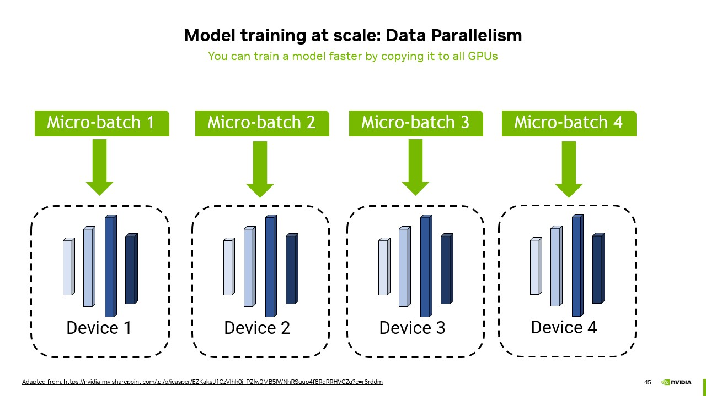
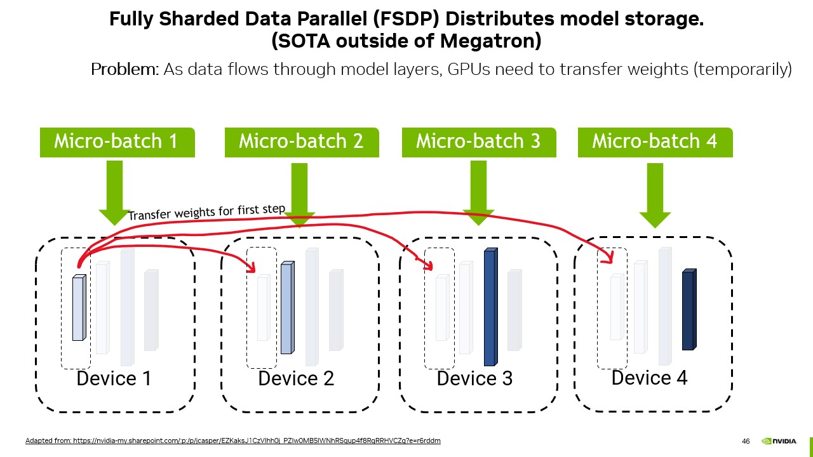
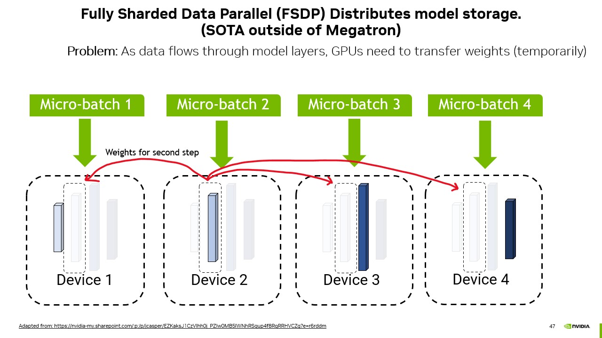
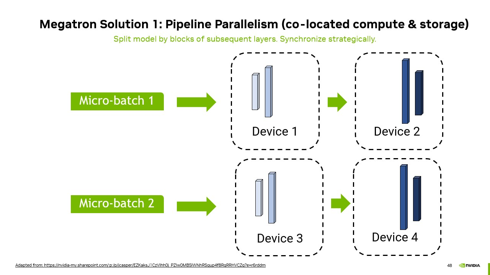
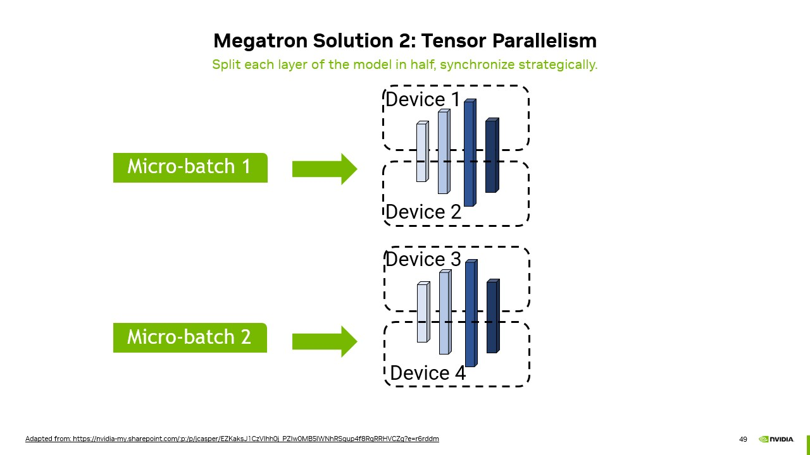
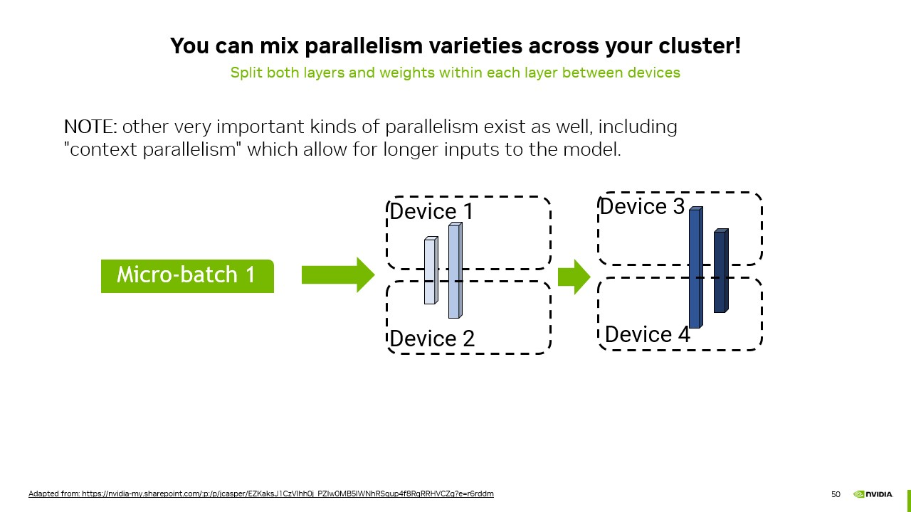
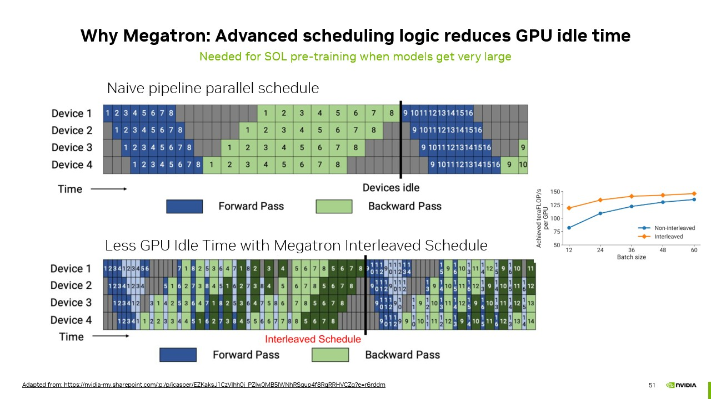

# NeMo2
NeMo2 represents tools and utilities to extend the capabilities of `pytorch-lightning` to support training and inference
with megatron models. While pytorch-lightning supports parallel abstractions sufficient for LLMs that fit on single GPUs
(distributed data parallel, aka DDP) and even somewhat larger architectures that need to be shareded across small
clusters of GPUs (fully sharded data parallel, aka FSDP), when you get to very large architectures and want the most
efficient pretraining and inference possible, megatron supported parallelism is a great option.

So in other words, NeMo2 adds the Megatron strategy in addition to the standard DDP and FSDP strategies.

Many downstream constraints, and conventions are driven by the underlying constraints of megatron.

## Deeper background on megatron
### Other options for parallelizing smaller models
Megatron is a system for supporting advanced varieties of model parallelism. While vanilla models can be executed
in parallel with systems such as distributed data parallel (DDP) or moderately large models can be trained with Meta's
Fully Sharded Data Parallel (FSDP/FSDP2), when you get to very large models and you want to train them with maximal
efficiency, you want some variant of megatron.

### DDP background
DDP is the best option **when you can fit the entire model on every GPU** in your cluster. With DDP, you can
parallelize your `global batch` across multiple GPUs by splitting it into smaller `mini-batches`, one for each GPU.
Each GPU computes the forward and backward pass independently for its subset of data, allowing for maximal utilization.
Synchronization of gradients occurs after the backward pass is complete for each batch, followed by a weight update
that ensures all GPUs have synchronized parameters for the next iteration. Here is an example of how this might appear
on your cluster with a small model:

### FSDP background
FSDP extends DDP by sharding (splitting) model weights across GPUs in your cluster to optimize memory usage.
While data is still split across GPUs in the same way as DDP, FSDP strategically synchronizes and broadcasts
the necessary shards of model weights to all GPUs just-in-time for computation during the forward pass.

For example, when a layer is needed for computation, the owning GPU sends that shard of weights to the other GPUs,
which then perform the forward computation on that layer. After the computation is complete, FSDP frees the memory for
that layer on all GPUs except the one that owns the shard. This process continues iteratively for each layer until the
entire model has been executed on the data.

Note that this process parallelizes the storage in a way that enables too large models to be executed (assuming a single
layer is not too large to fit on a GPU). Megatron (next) co-locates both storage and compute.

The following two figures show two steps through the forward pass of a model that has been sharded with FSDP.

### Model Parallelism
Model parallelism is the catch-all term for the variety of different parallelism strategies
that could be applied to parallelizing your model across a cluster. Below we explain several varieties of model
parallelism that are implemented in megatron. As mentioned in the previous section, one key advantage to the
megatron-specific parallelism types described next are that they co-locate storage and compute of the layers. Inefficiencies
caused by naieve scheduler implementations are also addressed (discussed in the section on schedulers).

#### Pipeline Parallelism
Pipeline parallelism is similar to FSDP, but the model blocks that are sharded are also computed in parallel on the
nodes that own the model weight in question. You can think of this as a larger simulated GPU that happens to be spread
across several child GPUs. Examples of this include `pipeline_parallel.is_pipeline_last_stage()` FIXME which is commonly
used to tell if a particular node is on last pipeline stage, where you compute the final head outputs, loss, etc.

#### Tensor Parallelism
Tensor parallelism represents splitting single layers across GPUs. This can also solve the problem where some individual
layers could in theory be too large to fit on a single GPU, which would make FSDP not possible. This would still work
since individual layer weights (and computations) are distributed. Examples of this in megatron include `RowParallelLinear` and
`ColumnParallelLinear` layers.

#### Sequence Parallelism
Sequence parallelism is the process of splitting the input sequence along the sequence dimension, applying the model
to the parts of the sequence, and then synchronizing those results afterwards.

TODO Someone with more experience than
the current author of this document should fill this section out further.

#### Context Parallelism
Context parallelism is the process of splitting the input sequence along the sequence dimension, applying the model
to the parts of the sequence, and then synchronizing those results afterwards. This replaces sequence-parallelism
and represents advanced strategies for reducing the multiple sequence chunks across attention layers
which need full knowledge of the overall sequence.

TODO someone with more experience than the current author of this document should fill out this section further.

#### Mixing parallelism strategies
You can mix multiple kinds of parallelism together to achieve a more performant result. In general experimentation
should be done to identify the optimal mix of parallelism (TODO link to Jared Casper's YouTube video).

#### Scheduling model parallelism
You can improve on naieve schedules by splitting up micro-batches into smaller pieces, executing multiple stages of the
model on single GPUs, and starting computing the backwards pass of one micro-batch while another is going through forward.
These optimizations allow for better cluster GPU utilization to be achieved. For example the following figure shows
how more advanced splitting techniques in megatron (eg the interleaved scheduler) provide better utilization when model
parallelism is used. Again when you can get away without using model parallelism (DDP), that is generally the best approach.

